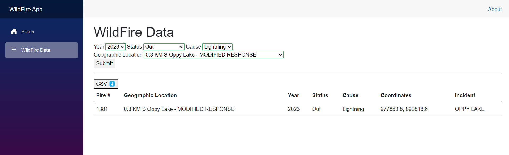

# WildFire App 🔥

This is a simple web application that consumes data from https://openmaps.gov.bc.ca/
via HTTP and displays response based on parameters passed.

Front end of the application is built with Blazor Pages in C#.

## Architecture Choices Explained

- Used .Net 8 as the Backend and Frontend Language.
   - Rich and Expressive C# Language. 
   - It also builds well for Linux and MacOS systems.
   - Few Dependencies
   - Statically Typed Code.
- Using Docker to compile for Linux. Web Server Exposed on Ports 8080/8081 when running.
- Not using a Database. It was possible to use a local Database (or)
  Files for Caching, Storing Data.
- However, Backend went into its own project and thus the Web Server can independantly
  abstract the Data to the Display or API as appropriate. Backend can change Data Source too.
- Not implementing any API routes. For this task, the idea is to use
  best practices for dynamic Blazor based display with Server Side Rendering,
  and Storing/Serializing/Deserializing Intermediary Data was avoided.
- Overall I/O Reliability was tested by turning off the Network Connections to
  see if any of the Backend Misbehaved.
- Using JavaScript Streaming services to Download CSV. Helps us maintain a
  stateful web application and re-use Server Side Data Objects.

## Requirements

- Visual Studio 2022 [Windows Only] or Visual Studio Code [Everywhere]
- .Net 8.0
- Docker Desktop - On Windows, also configured to run on WSL2, with a working Distribution (Debian Preferred)

### Package Dependencies

- CsvHelper (31.0.2)
- Newtonsoft.Json (13.0.3)

### Build Instructions

Download WildFireApp Solution at a location where
write permissions are available

### Running The App

```shell
dotnet run --project WildFireApp.Web
```

### Using the App

Once you run it, open it in the browser. Navigate to the 'WildFire Data'
page. Change the default filters and hit 'Submit'. To download this table
data as **CSV**, hit 'CSV ⬇️'.



### Building the App for Publishing

```shell
dotnet publish
```

### Running All Tests

```shell
dotnet test
```

### Building the Docker Image

```shell
docker build -t vaishnavitv/wildfireapp:latest -f WildFireApp.Web/Dockerfile .
```

Normally you would build and publish the Docker image to
a registry, and you would pull it before running in the Server
Environment.

### Running the Docker Image

A copy of this Docker image has already been published
to the Docker repository, just run this:

```shell
docker run -p 8080:8080 -p 8081:8081 --rm --name wildfireapp vaishnavitv/wildfireapp:latest
```

## Feedback

Reach out to me for any/all feedback and suggestions.